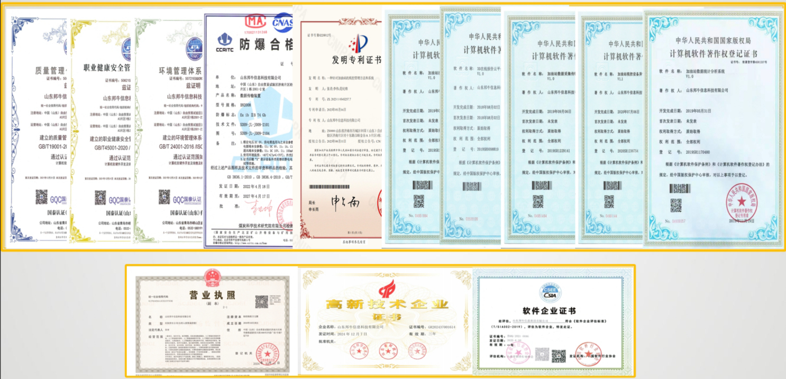
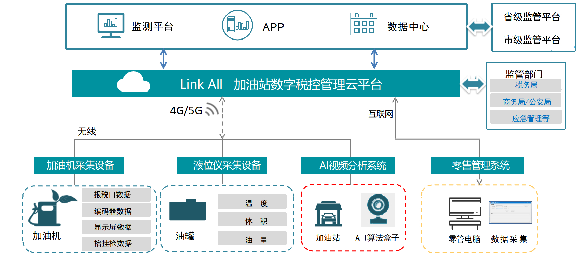
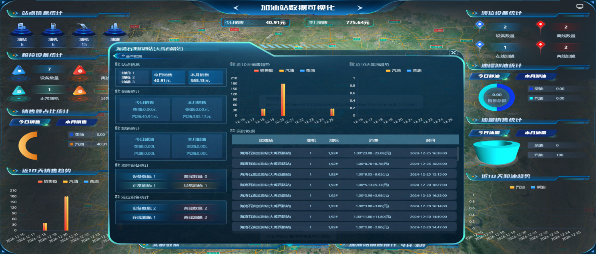
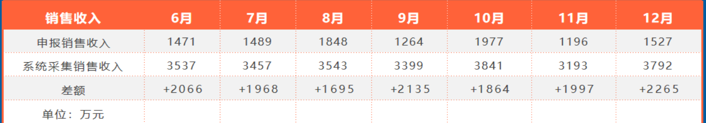

# 山东邦牛信息科技有限公司

山东邦牛信息科技有限公司是2016年10月成立的软件和信息技术服务业企业，为高新技术企业、科技型中小企业，位于济南自贸区内，定位为“专业政务软件外包服务商”。

## 一、主营业务

**核心产品方向**：覆盖市域综合治理平台、智慧镇街/社区综合业务平台、智慧农旅运营平台、加油站税控综合解决方案等，已交付智慧综治项目70余个、智慧社区项目120余个。

**服务领域**：面向政法委、公检法司等党政部门提供智慧政务服务，同时拓展至金融、教育、工业、税务、港口监管等领域，还涉及3D引擎研发、VR教育软件平台开发等业务。

## 二、核心技术

**技术底座**：融合大数据、物联网、云计算、AI人工智能技术，符合信创建设要求，自研加油站税控管理相关发明专利，拥有50余项软件著作权。

**特色能力**：智慧社区产品搭载数字孪生三维可视化、Cesium单体化分层分户工具，成品油监管系统可实现全链条数据实时采集、分析与税务合规校验。

## 三、核心业务与产品

公司定位为“专业政务软件外包服务商”，核心产品覆盖多个领域：

**智慧综治类**：市域综合治理平台、智慧镇街综合管理平台，已落地70余个项目。

**智慧社区类**：智慧社区综合业务平台，采用“管理平台+数字孪生三维大屏+微信小程序”架构，累计交付120余个项目。

**特色业务**：加油站税控综合解决方案平台，拥有相关发明专利，同时拓展智慧农旅、智慧人大、港口数智监管等领域项目。

